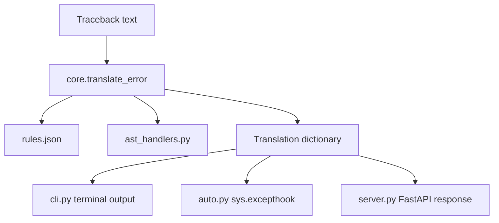

# System Architecture

This document describes the runtime architecture of Error Translator and the extension points contributors should use when evolving the project.

## Architectural goals

- **Deterministic translation** from traceback text to structured guidance.
- **Single core engine** reused by CLI, import hook, and API surfaces.
- **Rule-driven behavior** so most enhancements avoid risky core rewrites.
- **Incremental extensibility** through AST handlers and tests.

## High-level flow

## Runtime components

| Component | Responsibility |
|-----------|----------------|
| `error_translator/core.py` | Parses traceback text, selects the final error line, matches rules, and returns a translation dictionary. |
| `error_translator/rules.json` | Stores regex patterns and associated explanation/fix templates. |
| `error_translator/ast_handlers.py` | Adds optional contextual insights for selected error categories. |
| `error_translator/cli.py` | Implements the `explain-error` command and user-facing terminal formatting. |
| `error_translator/auto.py` | Installs a custom `sys.excepthook` for automatic translation of unhandled exceptions. |
| `error_translator/server.py` | Exposes `GET /` and `POST /translate` endpoints through FastAPI. |

## Translation lifecycle

1. Receive traceback text from CLI input, API request, or intercepted exception.
2. Extract the final non-empty error line.
3. Parse traceback metadata (`file`, `line`) when available.
4. Evaluate regex rules in `rules.json` in order.
5. Render explanation/fix templates using matched capture groups.
6. Read source code context from disk when file and line are known.
7. Query AST insight handlers when relevant.
8. Return a stable dictionary for downstream rendering.

## Output contract

Primary response fields:

- `explanation`
- `fix`
- `matched_error`
- `file`
- `line`
- `code`
- `ast_insight` (optional)

Contributors should preserve this contract unless there is a strong compatibility rationale and corresponding versioning discussion.

## Extension strategy for contributors

Use this order of operations when improving behavior:

1. **Rule change first** (`rules.json`) for coverage or wording improvements.
2. **AST handler updates** for context-aware suggestions.
3. **Core pipeline changes** only when rule-driven options are insufficient.
4. **Test updates** to lock in intended behavior.
5. **Documentation updates** to describe current behavior precisely.

## Supporting development scripts

- `builder.py`: assists with rule draft generation from scraped exception data.
- `scraper.py`: refreshes the exception dataset used by the builder workflow.

These scripts are optional and not required for the runtime translation path.
